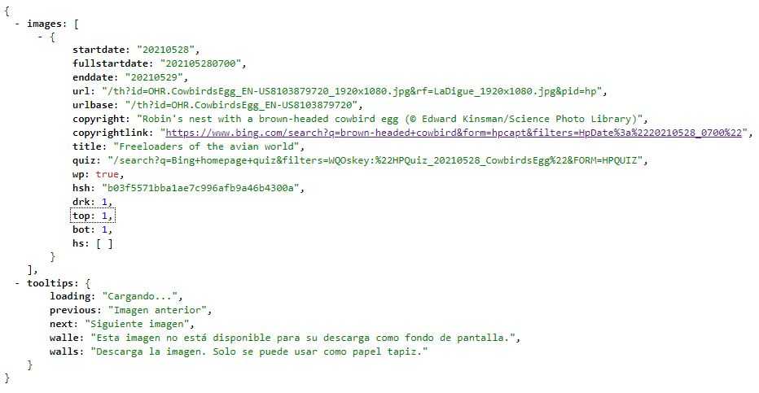

# Bing Image Extractor

## What is this?
This is a tiny library to extract the background image shown in Bing.com daily (*only the last one*)

## .NET Core 5
This code uses [**.NET Core 5**](https://dotnet.microsoft.com/download/dotnet/5.0) and **System.Text.Json** to deserialize the JSON document from [Bing.com](https://bing.com).

## How to use it?
The use of this library is very simple.

You have to instantiate the [**BingImageProcessor**](src/BingImageExtractor/BingImageProcessor.cs) only and call to the **GetBingImageAsync** method.

This method will return the URI with the image shown in Bing.com.

```csharp
var uri = await new BingImageProcessor().GetBingImageAsync();
```

# How to - Functional details to extract the image from Bing.com
There are three (3) different data sources to retrieve the Image from Bing.com.

- **JSON** [http://www.bing.com/HPImageArchive.aspx?format=js&idx=0&n=1&mkt=en-US](http://www.bing.com/HPImageArchive.aspx?format=js&idx=0&n=1&mkt=en-US)
- **RSS** [http://www.bing.com/HPImageArchive.aspx?format=rss&idx=0&n=1&mkt=en-US](http://www.bing.com/HPImageArchive.aspx?format=rss&idx=0&n=1&mkt=en-US)
- **XML** [http://www.bing.com/HPImageArchive.aspx?format=xml&idx=0&n=1&mkt=en-US](http://www.bing.com/HPImageArchive.aspx?format=xml&idx=0&n=1&mkt=en-US)

About the parameters of the data source:

- **n=** is an integer number that represents the number of images that we want to get. For this library, I am getting the last one only
- **mkt=** represents the location. For this library, I am using **en-US** only

Talking about the use of these different data sources, in this library, I am using the **JSON** document as data source.

Regarding the **JSON** document, in the library you will find the entities that are part of the **JSON** document too.

The entity **BingImage** represents an array, and in their first element you will find the image that we are looking for.

*JSON document sample extracted from Bing.com directly*



> Note: You could extend this library to get more images in older days, but this library get the last one only.
